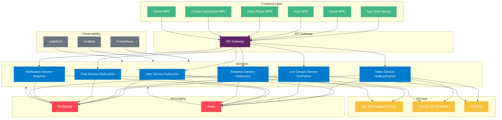

# Video Streaming Platform - Development Plan

A comprehensive, modern video streaming platform supporting both live streams and video-on-demand (VOD), inspired by Twitch and YouTube. Built with microservices and microfrontends, leveraging a polyglot stack, containerization, and robust observability.

---

## Table of Contents
- [Architecture Overview](#architecture-overview)
- [Tech Stack](#tech-stack)
- [System Components](#system-components)
- [Development Plan](#development-plan)
- [Mermaid System Diagram](#mermaid-system-diagram)
- [Microfrontends Architecture](#microfrontends-architecture)
- [Checklist: Adding a New Microfrontend](#checklist-adding-a-new-microfrontend)

---

## Architecture Overview
- **Microservices** for backend logic (REST & GraphQL APIs)
- **Microfrontends** for modular, scalable UI
- **Live Streaming** (RTMP, HLS, DASH)
- **VOD** (upload, encode, serve)
- **SQL & NoSQL** databases
- **Caching** (Redis)
- **Message Queues** (RabbitMQ)
- **Polyglot**: Python, JavaScript/TypeScript, Go, Ruby
- **Observability**: Prometheus, Grafana, centralized logging
- **Containerized**: Docker, orchestrated locally (Tilt, Docker Compose)

---

## Tech Stack
- **Frontend**: Next.js (React), Module Federation, TypeScript, TailwindCSS
- **Backend**: FastAPI (Python), Node.js/Express, Go, Ruby on Rails
- **APIs**: REST & GraphQL (Apollo, Graphene, etc.)
- **Databases**:
  - SQL: PostgreSQL, MySQL
  - NoSQL: MongoDB, DynamoDB
- **Cache**: Redis
- **Queue**: RabbitMQ
- **Video Processing**: FFmpeg, NGINX RTMP, custom Go/Python services
- **Containerization**: Docker, Docker Compose, Tilt
- **Observability**: Prometheus, Grafana, Loki (logs)
- **CI/CD**: GitHub Actions (optional)

---

## System Components
- **Frontend Layer**: Microfrontends (App Shell, Home, Auth, Video Player, Creator Dashboard, Admin)
- **API Gateway**: Unified entrypoint, routing, auth, rate limiting
- **Service Layer**:
  - User Service (auth, profiles)
  - Video Service (upload, encode, serve)
  - Live Stream Service (RTMP ingest, HLS/DASH output)
  - Chat Service (real-time chat)
  - Notification Service
  - Analytics Service
- **Messaging Layer**: RabbitMQ (events, async jobs), Redis (cache, pub/sub)
- **Storage**: Object storage (S3/minio), SQL/NoSQL DBs
- **Observability**: Prometheus, Grafana, Loki

---

## Development Plan

### 1. **Project Bootstrapping**
- [ ] Set up monorepo structure (e.g., `apps/`, `services/`, `infra/`, `microfrontends/`)
- [ ] Add Dockerfiles for all services and frontends
- [ ] Add Docker Compose/Tilt for local orchestration

### 2. **Microfrontends**
- [ ] App Shell (Next.js, Module Federation)
- [ ] Home/Discovery MFE
- [ ] Auth/Login MFE
- [ ] Video Player MFE
- [ ] Creator Dashboard MFE
- [ ] Admin MFE

### 3. **API Gateway**
- [ ] Implement API Gateway (Node.js/Express or Go)
- [ ] Add routing to microservices
- [ ] Add authentication, rate limiting

### 4. **User Service**
- [ ] Auth (JWT, OAuth)
- [ ] User profiles (CRUD)
- [ ] SQL DB (PostgreSQL)

### 5. **Video Service**
- [ ] Video upload endpoint
- [ ] Video encoding (FFmpeg jobs via RabbitMQ)
- [ ] Video metadata (NoSQL: MongoDB)
- [ ] Video serving (HLS/DASH)
- [ ] Object storage (S3/minio)

### 6. **Live Stream Service**
- [ ] RTMP ingest (NGINX RTMP or custom Go/Python)
- [ ] Transcoding to HLS/DASH
- [ ] Live session management
- [ ] Real-time metrics

### 7. **Chat Service**
- [ ] WebSocket server (Node.js, Go, or Python)
- [ ] Redis pub/sub for scaling
- [ ] Moderation tools

### 8. **Notification Service**
- [ ] Email, push, in-app notifications
- [ ] Event-driven via RabbitMQ

### 9. **Analytics Service**
- [ ] Collect view, engagement, and stream metrics
- [ ] Store in SQL/NoSQL
- [ ] Expose via GraphQL/REST

### 10. **Observability**
- [ ] Add Prometheus metrics to all services
- [ ] Centralized logging (Loki, ELK, etc.)
- [ ] Grafana dashboards

### 11. **CI/CD & DevOps**
- [ ] GitHub Actions for build/test
- [ ] Linting, formatting, type checks
- [ ] Automated Docker builds

---

## Mermaid System Diagram



---

## Microfrontends Architecture

This project uses a microfrontend architecture with [Module Federation](https://module-federation.io/) and local orchestration via [Tilt](https://tilt.dev/).

### Microfrontends Overview
- **next-app-shell** (host): Loads other microfrontends as remotes. Runs on [http://localhost:3000](http://localhost:3000)
- **next-app** (remote): Exposes its Home page. Runs on [http://localhost:3005](http://localhost:3005)
- **next-app-login** (remote): Exposes its Home page. Runs on [http://localhost:3006](http://localhost:3006)

#### Communication
- All microfrontends use Module Federation for runtime component sharing.
- The shell references remotes by their local URLs and remoteEntry.js files.

### Local Development with Tilt
A `Tiltfile` is provided in the `infra/` folder. It:
- Runs all microfrontends in parallel using their `yarn dev` scripts.
- Watches for code changes and restarts as needed.
- Provides clickable links in the Tilt UI for each app.

**To start all microfrontends:**
```sh
cd infra
# (install Tilt if needed: https://docs.tilt.dev/install.html)
tilt up
```

---

## Checklist: Adding a New Microfrontend
- [ ] Create a new folder in `microfrontends/`
- [ ] Expose components/pages via Module Federation in `next.config.ts`
- [ ] Assign a unique port in the dev script
- [ ] Add the new remote to `next-app-shell`'s remotes config
- [ ] Add a new `nextjs_app` entry in `infra/Tiltfile`
- [ ] Test local communication via Module Federation

---

**Access your microfrontends after running Tilt:**
- Shell (host): [http://localhost:3000](http://localhost:3000)
- App (remote): [http://localhost:3005](http://localhost:3005)
- Login (remote): [http://localhost:3006](http://localhost:3006)


    %% Legend
    subgraph Legend["Legend"]
        F[Frontend Component]:::frontend
        S[Service Component]:::service
        M[Messaging System]:::messaging
        I[Infrastructure]:::infra
    end
```

# Microfrontends Architecture & Local Orchestration

This project uses a microfrontend architecture with [Module Federation](https://module-federation.io/) and local orchestration via [Tilt](https://tilt.dev/).

## Microfrontends Overview

- **next-app-shell** (host): Loads other microfrontends as remotes. Runs on [http://localhost:3000](http://localhost:3000)
- **next-app** (remote): Exposes its Home page. Runs on [http://localhost:3005](http://localhost:3005)
- **next-app-login** (remote): Exposes its Home page. Runs on [http://localhost:3006](http://localhost:3006)

### Communication
- All microfrontends use Module Federation for runtime component sharing.
- The shell references remotes by their local URLs and remoteEntry.js files.

## Local Development with Tilt

A `Tiltfile` is provided in the `infra/` folder. It:
- Runs all microfrontends in parallel using their `yarn dev` scripts.
- Watches for code changes and restarts as needed.
- Provides clickable links in the Tilt UI for each app.

**To start all microfrontends:**
```sh
cd infra
# (install Tilt if needed: https://docs.tilt.dev/install.html)
tilt up
```

## Visual Architecture

```mermaid
flowchart TD
    Shell[next-app-shell (host)\n:3000]:::host
    Login[next-app-login (remote)\n:3006]:::remote
    App[next-app (remote)\n:3005]:::remote

    Shell -- Module Federation --> Login
    Shell -- Module Federation --> App

    classDef host fill:#007acc,color:#fff,stroke:#007acc
    classDef remote fill:#42b883,color:#fff,stroke:#42b883
```

## Checklist: Adding a New Microfrontend
- [ ] Create a new folder in `microfrontends/`
- [ ] Expose components/pages via Module Federation in `next.config.ts`
- [ ] Assign a unique port in the dev script
- [ ] Add the new remote to `next-app-shell`'s remotes config
- [ ] Add a new `nextjs_app` entry in `infra/Tiltfile`
- [ ] Test local communication via Module Federation

---

**Access your microfrontends after running Tilt:**
- Shell (host): [http://localhost:3000](http://localhost:3000)
- App (remote): [http://localhost:3005](http://localhost:3005)
- Login (remote): [http://localhost:3006](http://localhost:3006)


