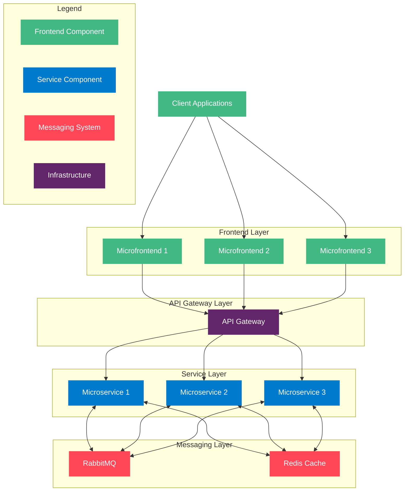

# video-streaming-app
Repository destinated to study how a video is streamed on demand

# Standard protocols for live streaming include:

- RTMP (Real-Time Messaging Protocol): This was originally developed by Macromedia to transmit data between a Flash player and a server. Now it is used for streaming video data over the internet. Note that video conferencing applications like Skype use RTC (Real-Time Communication) protocol for lower latency.
- HLS (HTTP Live Streaming): It requires the H.264 or H.265 encoding. Apple devices accept only HLS format.
- DASH (Dynamic Adaptive Streaming over HTTP): DASH does not support Apple devices.
- Both HLS and DASH support adaptive bitrate streaming.


# Architeture

https://excalidraw.com/#json=ePw5gyX2Y2Q7t84yHDilK,3Nxi5-GevPWPpKE-8qyGzQ




# Microfrontends Architecture & Local Orchestration

This project uses a microfrontend architecture with [Module Federation](https://module-federation.io/) and local orchestration via [Tilt](https://tilt.dev/).

## Microfrontends Overview

- **next-app-shell** (host): Loads other microfrontends as remotes. Runs on [http://localhost:3000](http://localhost:3000)
- **next-app** (remote): Exposes its Home page. Runs on [http://localhost:3005](http://localhost:3005)
- **next-app-login** (remote): Exposes its Home page. Runs on [http://localhost:3006](http://localhost:3006)

### Communication
- All microfrontends use Module Federation for runtime component sharing.
- The shell references remotes by their local URLs and remoteEntry.js files.

## Local Development with Tilt

A `Tiltfile` is provided in the `infra/` folder. It:
- Runs all microfrontends in parallel using their `yarn dev` scripts.
- Watches for code changes and restarts as needed.
- Provides clickable links in the Tilt UI for each app.

**To start all microfrontends:**
```sh
cd infra
# (install Tilt if needed: https://docs.tilt.dev/install.html)
tilt up
```

## Visual Architecture

```mermaid
flowchart TD
    Shell[next-app-shell (host)\n:3000]:::host
    Login[next-app-login (remote)\n:3006]:::remote
    App[next-app (remote)\n:3005]:::remote

    Shell -- Module Federation --> Login
    Shell -- Module Federation --> App

    classDef host fill:#007acc,color:#fff,stroke:#007acc
    classDef remote fill:#42b883,color:#fff,stroke:#42b883
```

## Checklist: Adding a New Microfrontend
- [ ] Create a new folder in `microfrontends/`
- [ ] Expose components/pages via Module Federation in `next.config.ts`
- [ ] Assign a unique port in the dev script
- [ ] Add the new remote to `next-app-shell`'s remotes config
- [ ] Add a new `nextjs_app` entry in `infra/Tiltfile`
- [ ] Test local communication via Module Federation

---

**Access your microfrontends after running Tilt:**
- Shell (host): [http://localhost:3000](http://localhost:3000)
- App (remote): [http://localhost:3005](http://localhost:3005)
- Login (remote): [http://localhost:3006](http://localhost:3006)


